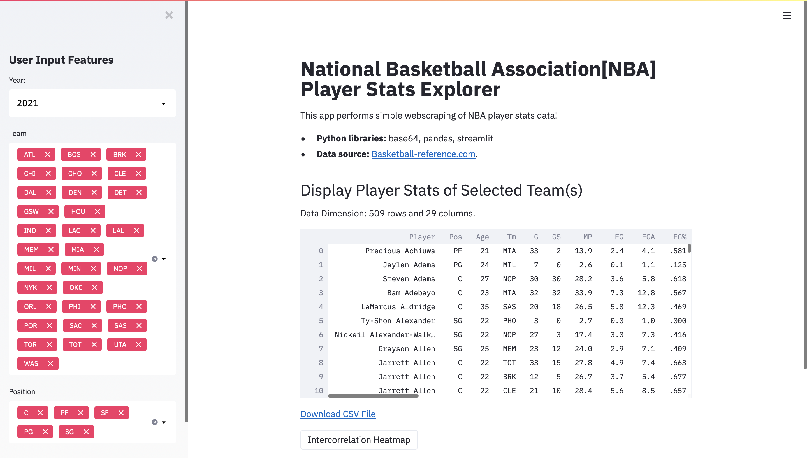
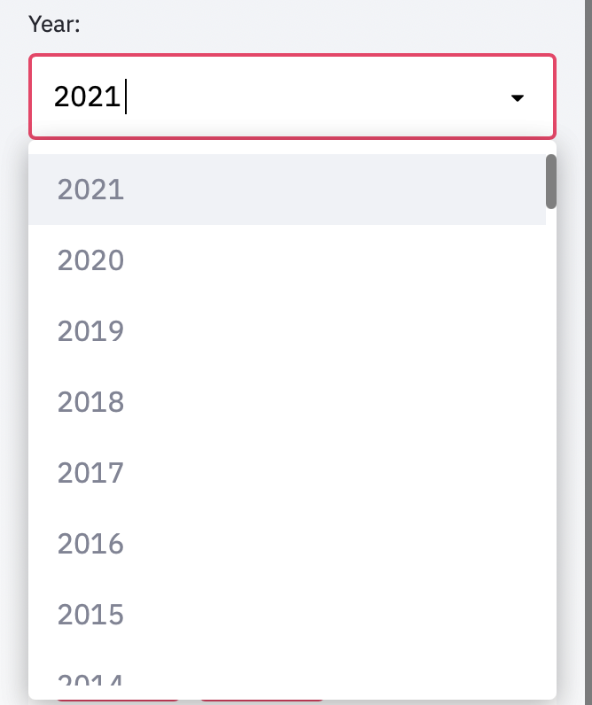
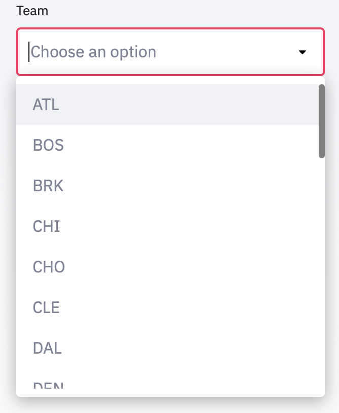
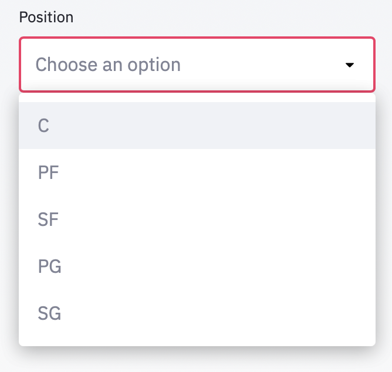
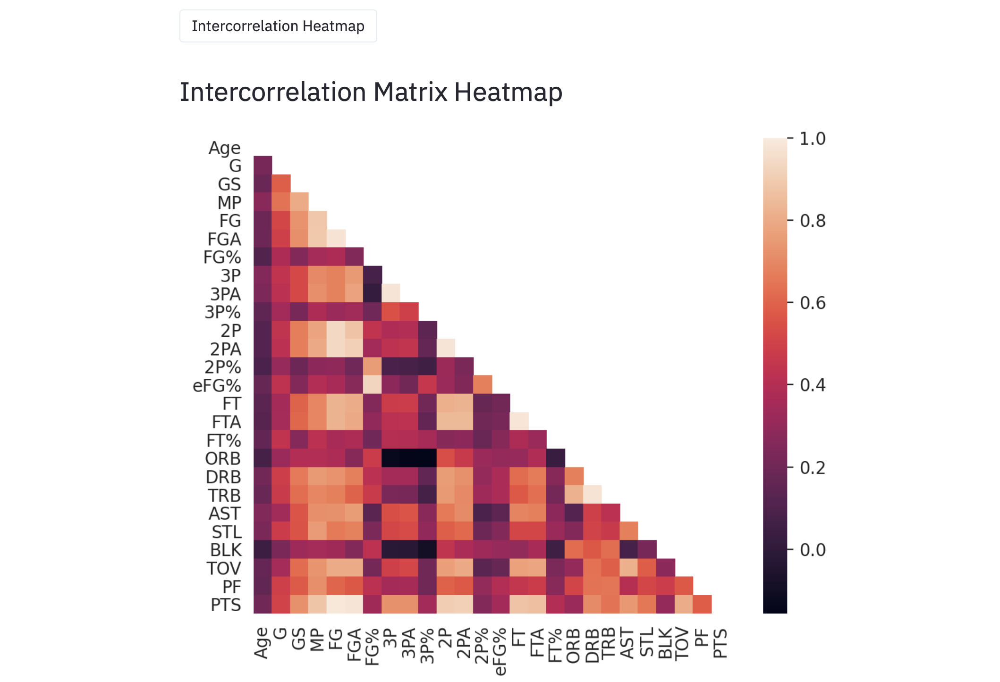

# Basketball player analysis 

- Built with python

## Screen shots Of the Running App

### Main Page:

(The client side visible-page)

### Dropdown menu for selecting year:

### Droupdown menu for Team selection:

### Droupdown menu for position selection:

### Heatmap:

(Heatmap is genrated after clicking on button: Intercorrelation Heatmap)

# Getting Started with Creating Python App and Running the project on Streamlit Network

We used Streamlit for running our project we can visit \
Local URL: http://localhost:8501 \
Network URL: http://10.0.0.127:8501

## Library needed to install:

We have to install few libraries before running this app are

### pip install streamlit

This library is used for building the app on Streamlit.

### pip insall pandas
### pip install numpy

This library is used for Data Framing and Data Scrapping \
We are going to use 'https://www.basketball-reference.com' website for fatching our data. 

### pip install pybase64v

This library is used for running base64 used for downloading csv files. It helps convert ASCII to bytes. 

### python -m pip install -U matplotlib
### pip install seaborn

This libraries are used for creating Heatmap.

## Run the app
### Streamlit run basketball-app.py 

